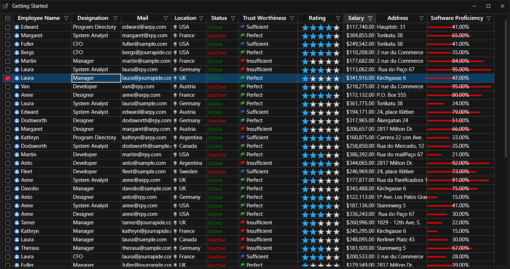

# How to customize themes using WPF SkinManager?

This sample loads [Datagrid](https://help.syncfusion.com/wpf/datagrid/getting-started) and Window with custom theme look using SkinManager Theme and register theme settings support.

