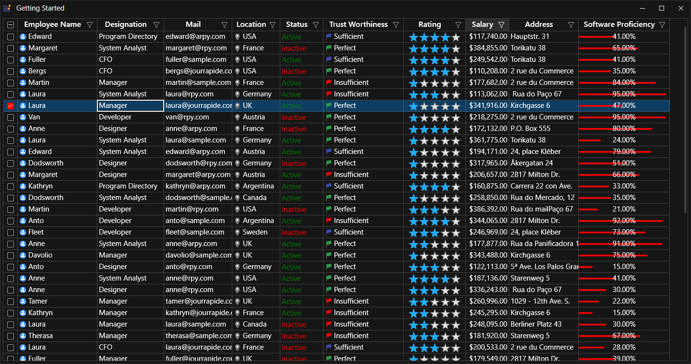

# How to customize themes using WPF SkinManager?

This sample loads [Datagrid](https://help.syncfusion.com/wpf/datagrid/getting-started) and Window with custom theme look using SkinManager Theme and register theme settings support.

## Overview

The WPF SkinManager provides a powerful theming engine that allows developers to create stunning, consistent user interfaces across their entire application. This sample demonstrates how to apply custom themes to Syncfusion WPF controls, specifically focusing on the DataGrid component.

## Features Demonstrated

- Theme Registration: Learn how to register custom themes with the SkinManager to make them available throughout your application.
- DataGrid Theming: Apply professional-looking themes to the DataGrid control with minimal code.
- Window Customization: Extend theming to the entire window for a cohesive visual experience.
- Runtime Theme Switching: Enable users to change themes dynamically without restarting the application.

## Implementation Details

The SkinManager simplifies theme management by providing a centralized approach to styling. You can easily switch between built-in themes or create custom color schemes that match your brand identity.